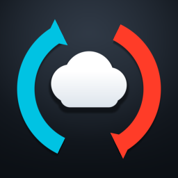

<div align="center">



# SwitchSaveSync

**Save de Switch no Google Drive, num clique só.**
Abre o app, aperta A no jogo, pronto — ele decide sozinho se sobe ou se desce.

[](https://switchbrew.org/)
[](https://github.com/Atmosphere-NX/Atmosphere)
[](https://devkitpro.org/)
[](#tamb%C3%A9m-tem)
[](#onde-foi-testado)
[](LICENSE)

[English](README.en.md)

</div>

---

## O que é

Um homebrew que guarda os saves dos seus jogos no **seu** Google Drive e traz de volta
quando você precisa — do jeito que o Steam Cloud faz, mas sem servidor, sem assinatura e
sem custo nenhum. Não existe backend: o console fala direto com a API do Google Drive,
usando uma conta que é sua.

Ele **nunca interpreta o conteúdo do save**. Copia a árvore de arquivos byte a byte nos
dois sentidos. Por isso funciona em jogo que nunca foi testado — inclusive jogo que ainda
nem saiu — sem precisar de lista de jogos suportados.

## Antes de mais nada

Olha... isso aqui foi feito por **uma pessoa só**. Uma. Sem equipe de testes, sem QA, sem
ninguém pra olhar por cima do meu ombro e dizer *"tem certeza disso?"*. Foi testado no meu
console, com os meus jogos, do meu jeito.

Então sim, pode ter bug. Provavelmente tem, e eu ainda não faço ideia de qual — só vou
descobrir do pior jeito possível, que é alguém me contando que quebrou.

**Se você achar algum, me conta?** Por favor mesmo. Não precisa ser bonito nem técnico: um
*"travou quando eu fiz tal coisa"* já me ajuda mais do que você imagina. É logo ali nas
[Issues](https://github.com/NspxMiguel/SwitchSaveSync/issues).

Eu conserto. Choro um pouquinho antes, mas conserto.

E antes que dê ruim: **guarda uma cópia dos saves que você não pode perder.** Não porque eu
ache que vai dar errado — mas porque save é save, e eu ia dormir bem melhor sabendo que
você tem uma.

## O clique único

O botão **A** faz a coisa certa sozinho, comparando uma impressão digital do save dos dois
lados com a da última sincronização:

| Situação | O que ele faz |
| --- | --- |
| Só o console mudou | Sobe pro Drive |
| Só o Drive mudou | Baixa pro console |
| Nenhum dos dois mudou | Não encosta em nada |
| O console não tem save ainda | Baixa do Drive |
| **Os dois mudaram** | **Para e pergunta** |

O último caso é o importante: escolher sozinho ali apagaria progresso de verdade. O app
mostra os dois lados (quantos arquivos, quantos bytes) e deixa a decisão com você. Nada é
escrito enquanto você não apertar.

O botão **Y** abre o menu com as ações separadas, pra quando você quiser mandar em vez de
deixar ele decidir: subir, baixar, backup no cartão, restaurar do cartão.

## O que ele faz que os outros não fazem

**Save separado por conta.** O mesmo jogo jogado por dois perfis do console tem dois saves
diferentes, e eles não se misturam. O jogo aparece uma vez na lista, com `2 saves` do lado,
e a escolha de quem é o save acontece no clique.

**Save de console, não só de conta.** Existem dois tipos de save no Switch: o de conta
(`FsSaveDataType_Account`) e o de console (`FsSaveDataType_Device`), que é do aparelho e não
de um perfil. Animal Crossing é o caso feio: **a ilha é save de console**, e o save de conta
existe e é quase vazio. Ferramenta que só lê save de conta faz "backup do Animal Crossing"
e não leva a ilha junto. Pokémon Sword/Shield usa os dois tipos. Aqui os dois são lidos.

**Espelho de verdade.** Arquivo que o jogo apagou do save também sai da nuvem — senão ele
voltaria vivo no próximo restore. Some pra lixeira do Drive, não de vez: você tem 30 dias
pra desfazer.

**Backup no próprio cartão.** Sem internet e sem conta Google, dá pra guardar uma cópia em
`sdmc:/switch/SwitchSaveSync/backups` e restaurar de lá. É a rede de segurança pra quando a
nuvem não é uma opção.

## Também tem

- **Sincronizar tudo de uma vez** — uma linha no topo da lista passa por todos os saves,
  decidindo pra que lado cada um vai. Quando os dois lados mudaram ele **não** escolhe:
  aquele jogo fica de fora e sai listado no fim, pra você resolver um a um.
- **Tudo num arquivo só** — opcional: junta todos os saves num `.nxsaves`, um formato nosso que
  não é zip e que só este app lê. Serve pra levar tudo de uma vez. *É disfarce, não
  cadeado* — o código é aberto, então quem quiser de verdade lê. Por isso o modo normal
  (uma pasta por jogo no Drive) continua sendo o recomendado: save preso num formato que só
  um programa lê é save que morre junto com o programa.
- **Login por QR code** — aponta o celular, digita o código, pronto. Sem teclado de tela.
- **Controle parental** — senha de 4 a 8 dígitos na abertura do app, guardada como hash.
  Trocar ou tirar a senha exige a atual.
- **Lista por último jogado**, com o ícone e o nome de verdade de cada jogo, lidos do
  console.
- **Português e inglês**, com o idioma seguindo o console ou escolhido na mão.

## Onde foi testado

**Switch V2 com firmware 18.1.0, em Atmosphère.** É o console em que ele foi escrito e é
onde ele roda todo dia — o resto é honestidade sobre o que ninguém tentou ainda.

Nada aqui depende de versão: o app não tem tabela de offsets, não faz patch em nada e não
lê estrutura interna de save. Ele usa as chamadas de montar save da libnx, que são as
mesmas desde o firmware 1.0, e a API do Google Drive, que é HTTPS. Então a chance de
quebrar numa versão diferente é baixa — mas *baixa* não é *testada*, e é isso que este
parágrafo está dizendo.

Se rodar (ou não rodar) em outra versão, [abra uma
issue](https://github.com/NspxMiguel/SwitchSaveSync/issues) contando qual — dá pra
transformar isto numa lista de verdade.

## Instalar

Precisa de um console com CFW (**Atmosphère**) e o menu de homebrew funcionando. Se isso
ainda não está de pé, resolve primeiro — é assunto de outro tutorial, não deste.

### 1. Baixar

Pega o `SwitchSaveSync.nro` na **[última versão](https://github.com/NspxMiguel/SwitchSaveSync/releases/latest)**.

É um arquivo só. Não tem instalador, não tem dependência, não tem conta pra criar aqui.

### 2. Copiar pro cartão

Põe o `SwitchSaveSync.nro` em `sdmc:/switch/`. Pode ser tirando o cartão e usando o PC, ou
por FTP se você já usa um.

### 3. Abrir

Pelo menu de homebrew — mas **segurando R num jogo, não pelo Álbum**.

> Aberto pelo Álbum, o homebrew roda em *modo applet*: ganha só ~448 MB de memória e a
> pilha de rede às vezes nem sobe. Segurando **R** ao abrir um jogo instalado, o menu de
> homebrew abre no lugar do jogo e roda como aplicação, com a memória e a rede inteiras. Se
> tiver dúvida de em qual modo você está, o próprio app diz: aba **Ajustes**, em
> Diagnóstico.
>
> Isso deixa de ser necessário depois do passo 5.

### 4. Entrar na sua conta

Na primeira vez, o app mostra um **código** e um endereço (e um QR Code, se preferir a
câmera do celular). Você abre esse endereço no celular ou no PC, digita o código e autoriza.

**O console nunca pede a sua senha.** Quem faz login é você, na página do próprio Google.

O acesso pedido é o **`drive.file`**: o app só enxerga os arquivos que ele mesmo criou. O
resto do seu Drive fica invisível pra ele — não é promessa minha, é o Google que não deixa.

O login fica guardado só no cartão, em `/switch/SwitchSaveSync/token.txt`, e sai de vez no
**Sair da conta**.

> **De quem é a credencial?** É minha — o app vem com ela embutida, pra você não precisar
> criar projeto no Google Cloud pra usar um homebrew de save. A **conta é sua**, o **Drive
> é seu** e os **arquivos são seus**: eu não tenho acesso a nada disso, e o `drive.file`
> impede até o app de olhar o resto do seu Drive. Se ainda assim você preferir usar uma
> credencial sua, é só [compilar](#compilar-com-a-sua-própria-credencial) — o caminho
> continua aberto.

### 5. Pronto — e opcionalmente, com cara de jogo

Já dá pra usar: abre, aperta **A** num jogo, e ele resolve o resto.

### Deixar com cara de jogo, na tela inicial

Dá pra ter um ícone do app na tela inicial do console, do lado dos jogos, e abrir dali. O
[Sphaira](https://github.com/ITotalJustice/sphaira) faz isso sozinho, **no próprio
console** — não precisa de PC, nem de `hacbrewpack`, nem da sua `prod.keys`: ele deriva a
chave direto do console.

1. Abra o Sphaira e ache o `SwitchSaveSync` na lista de homebrew.
2. Abra as opções e escolha **Install Forwarder**.
3. Instalar vem desligado de fábrica no Sphaira; ele pergunta se pode ligar — responda que
   sim.

O atalho nasce com o nome e o ícone que estão dentro do `.nro`, então aparece como
**SwitchSaveSync**, de *Miguel*, com o mesmo ícone daqui de cima.

E resolve o parágrafo anterior de quebra: o atalho é instalado como *aplicação*, então
abrir por ele já dá a memória e a rede inteiras. O truque do **R** deixa de ser necessário.

> **Não mude o `.nro` de lugar depois.** O atalho guarda o caminho do arquivo, e o Sphaira
> tira o ID do título de um hash desse caminho. Movido o arquivo, o atalho aponta pro vazio
> — e refazer o atalho a partir do caminho novo cria um segundo ícone em vez de consertar o
> primeiro. Deixe em `sdmc:/switch/SwitchSaveSync.nro` e pronto.

## Onde os saves vão parar

Numa pasta `Nintendo Switch Saves/`, na raiz do seu Drive (ou do seu WebDAV), com uma
subpasta por jogo e os arquivos soltos lá dentro. Nada de formato fechado: dá pra abrir
pelo site da nuvem e baixar um save na mão quando quiser.

Quando um jogo tem save de mais de uma conta, o apelido entra no nome da pasta — *Mario
Kart 8 Deluxe (Player 1)*. Só o nome: quem identifica de verdade é o par jogo + conta,
anotado em `/switch/SwitchSaveSync/pastas.txt`. Por isso você pode renomear a conta do
console à vontade que o app não perde o backup de vista.

## Compilar com a sua própria credencial

Nada disso é necessário pra usar o app — é pra quem prefere não passar pela minha
credencial, ou pra quem vai mexer no código.

Precisa do [devkitPro](https://devkitpro.org/wiki/Getting_Started) com o grupo
`switch-dev`, mais `switch-curl`, `switch-mbedtls` e `switch-zlib`.

```bash
cp core/config.h.example core/config.h
```

O `config.h.example` tem o passo a passo com as telas: criar um projeto no
[console.cloud.google.com](https://console.cloud.google.com), ativar a **Google Drive API**,
montar a tela de consentimento e gerar um ID de cliente do tipo **"TVs e dispositivos de
entrada limitada"** — é esse tipo, e não outro: é o que libera o login por código, sem
teclado.

Um detalhe que economiza uma dor de cabeça: na tela de consentimento, deixe o status como
**"Em produção"**. Em *"Testing"*, o Google expira o login a cada **7 dias**. Como o
`drive.file` é um escopo não-sensível, publicar é imediato — não passa por verificação
nenhuma.

Cole o ID e o segredo no `config.h`; ele está no `.gitignore` e nunca entra em commit.

```bash
export DEVKITPRO=/opt/devkitpro
export DEVKITA64=$DEVKITPRO/devkitA64
export PATH=$DEVKITPRO/tools/bin:$DEVKITA64/bin:$PATH
make -C gui
```

Sai um `gui/SwitchSaveSync.nro` — daí é o passo 2 da instalação em diante.

As outras pastas compilam do mesmo jeito (`make -C app`, `make -C sysmodule`), mas veja o
[estado do projeto](#estado-do-projeto) antes: elas estão paradas de propósito.

## O que ele não faz

- **Não mexe em save de jogo aberto.** O jogo tem que estar fechado; o app avisa quando não
  consegue montar.
- **Não interpreta save.** Não edita, não converte, não "conserta" save.
- **Não sobe nada sozinho.** Sincronização é sempre um clique seu. O modo automático está
  planejado, mas não existe ainda.
- **Não se instala no boot.** Nada de `boot2.flag` — decisão consciente: homebrew que sobe
  junto com o console é homebrew que pode deixar o console sem subir.

## Estado do projeto

O **app gráfico** (`gui/`) é o que está pronto e em uso. As outras pastas são caminhos que
foram abertos e estão parados de propósito:

| Pasta | O que é | Estado |
| --- | --- | --- |
| `gui/` | O app, em [borealis](https://github.com/natinusala/borealis) | **Em uso** |
| `core/` | O motor: Drive, OAuth, montagem de save, sincronização | **Em uso** |
| `app/` | Primeira versão, em modo texto | Histórico |
| `sysmodule/` | Autosync rodando de fundo | Pausado |
| `overlay/` | Menu no Ultrahand/Tesla | Pausado |

O autosync vai voltar como uma tela na **abertura** do jogo — "sincronizando, aguarde", com
barra de porcentagem e um botão **Pular** pra quem não quer esperar. Ainda não está feito.

## Leitura

- [`ANALISE.md`](ANALISE.md) — a análise de viabilidade que começou o projeto: o que já
  existia pronto, o que precisava ser construído, e onde estava o risco.
- [`SAVES.md`](SAVES.md) — como save de Switch funciona de verdade, e o que isso obriga o
  app a fazer.
- [`NUVENS.md`](NUVENS.md) — **como adicionar uma nuvem nova você mesmo** (OneDrive,
  Dropbox, o que for): as doze funções que faltam escrever, onde registrar, e os endpoints
  do OneDrive já mastigados. Não precisa pedir pra mim — é um arquivo novo, não uma
  cirurgia.

## Créditos

[borealis](https://github.com/natinusala/borealis) pela interface,
[libnx](https://github.com/switchbrew/libnx) e [devkitPro](https://devkitpro.org/) pelo
resto, [Atmosphère](https://github.com/Atmosphere-NX/Atmosphere) por existir,
[qrcodegen](https://github.com/nayuki/QR-Code-generator) pelo QR do login.

O caminho de save de console veio de olhar onde o [JKSV](https://github.com/J-D-K/JKSV) e o
[Checkpoint](https://github.com/FlagBrew/Checkpoint) tropeçam — os dois têm issue aberta
sobre isso.

## Licença

[GPLv3](LICENSE) — a mesma do Atmosphère, do JKSV e do Checkpoint. Use, estude, modifique e
distribua à vontade; quem distribuir uma versão modificada tem que abrir o código dela
também.
