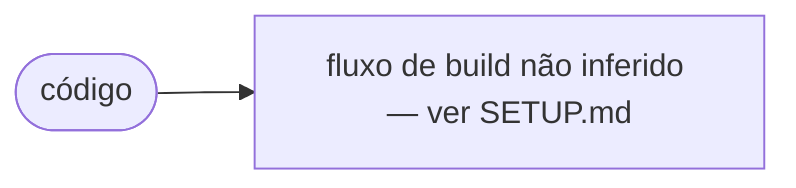

# Architecture — SwitchSaveSync

## Overview

## Stack (extraído do repositório)

| Camada | Tecnologia | Versão / nota |
| --- | --- | --- |
| — | Não inferida automaticamente | Ver manifests |

## Alvos / targets

_Sem `project.yml` com targets, ou projeto não-Xcode._

## Diagrama de pastas (topo)

```mermaid
flowchart TD
  SwitchSaveSync["SwitchSaveSync"]
  SwitchSaveSync --> n0["ANALISE.md"]
  SwitchSaveSync --> n1["CLOUDS.md"]
  SwitchSaveSync --> n2["INSTALACAO.md"]
  SwitchSaveSync --> n3["INSTALL.md"]
  SwitchSaveSync --> n4["LICENSE"]
  SwitchSaveSync --> n5["NUVENS.md"]
  SwitchSaveSync --> n6["PEDIDOS.md"]
  SwitchSaveSync --> n7["README.md"]
  SwitchSaveSync --> n8["README.pt-BR.md"]
  SwitchSaveSync --> n9["SAVES.md"]
  SwitchSaveSync --> n10["app/"]
  SwitchSaveSync --> n11["assets/"]
  SwitchSaveSync --> n12["backup-cartao.sh"]
  SwitchSaveSync --> n13["backups-do-switch/"]
  SwitchSaveSync --> n14["build-symbols/"]
  SwitchSaveSync --> n15["cartao/"]
  SwitchSaveSync --> n16["core/"]
  SwitchSaveSync --> n17["docs/"]
```

## Fluxo de build (inferido)

