# Estrutura — SwitchSaveSync

## Pastas de topo

```
SwitchSaveSync/
├── ANALISE.md
├── CLOUDS.md
├── INSTALACAO.md
├── INSTALL.md
├── LICENSE
├── NUVENS.md
├── PEDIDOS.md
├── README.md
├── README.pt-BR.md
├── SAVES.md
├── app/
├── assets/
├── backup-cartao.sh
├── backups-do-switch/
├── build-symbols/
├── cartao/
├── core/
├── docs/
├── enviar-pro-switch.sh
├── gui/
├── hbas/
├── install.bat
├── install.ps1
├── install.sh
├── overlay/
├── pegar-do-switch.sh
├── servidor/
├── sysmodule/
├── tests/
```

## Diagrama

```mermaid
flowchart TD
  SwitchSaveSync["SwitchSaveSync"]
  SwitchSaveSync --> n0["ANALISE.md"]
  SwitchSaveSync --> n1["CLOUDS.md"]
  SwitchSaveSync --> n2["INSTALACAO.md"]
  SwitchSaveSync --> n3["INSTALL.md"]
  SwitchSaveSync --> n4["LICENSE"]
  SwitchSaveSync --> n5["NUVENS.md"]
  SwitchSaveSync --> n6["PEDIDOS.md"]
  SwitchSaveSync --> n7["README.md"]
  SwitchSaveSync --> n8["README.pt-BR.md"]
  SwitchSaveSync --> n9["SAVES.md"]
  SwitchSaveSync --> n10["app/"]
  SwitchSaveSync --> n11["assets/"]
  SwitchSaveSync --> n12["backup-cartao.sh"]
  SwitchSaveSync --> n13["backups-do-switch/"]
  SwitchSaveSync --> n14["build-symbols/"]
  SwitchSaveSync --> n15["cartao/"]
  SwitchSaveSync --> n16["core/"]
  SwitchSaveSync --> n17["docs/"]
```



## Componentes / módulos importantes

### `App/`

- `Makefile`
- `README.md`
- `SwitchSaveSync.elf`
- `SwitchSaveSync.nacp`
- `SwitchSaveSync.nro`
- `romfs/`
- `source/`

### `Core/`

- `cloud.c`
- `cloud.h`
- `cloud_backend.h`
- `config.h`
- `config.h.example`
- `credencial.c`
- `credencial.h`
- `drive.c`
- `drive.h`
- `http.c`
- `http.h`
- `lang.c`
- `lang.h`
- `minijson.c`
- `minijson.h`
- `nxsaves.c`
- `nxsaves.h`
- `oauth.c`
- `oauth.h`
- `qrcodegen/`
- `savemount.c`
- `savemount.h`
- `syncjob.c`
- `syncjob.h`
- `syncstate.c`
- `syncstate.h`
- `titles.c`
- `titles.h`
- `webdav.c`
- `webdav.h`

### `app/`

- `Makefile`
- `README.md`
- `SwitchSaveSync.elf`
- `SwitchSaveSync.nacp`
- `SwitchSaveSync.nro`
- `romfs/`
- `source/`
